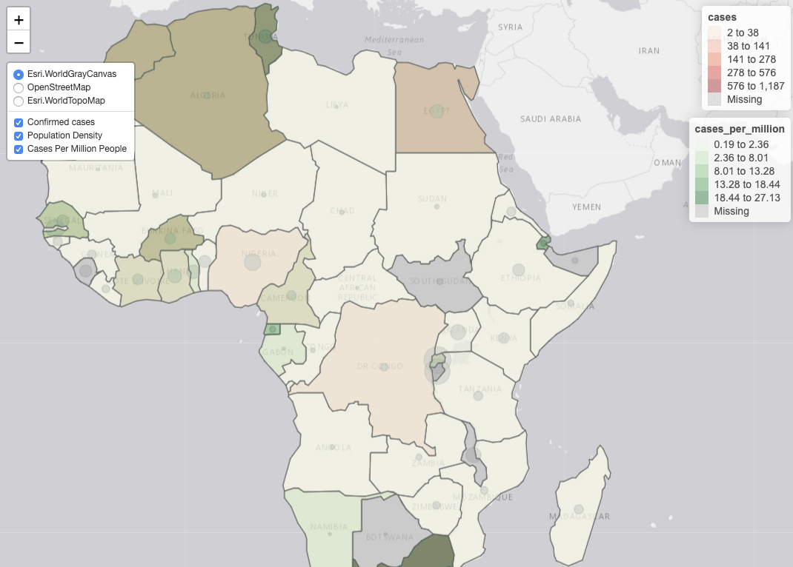
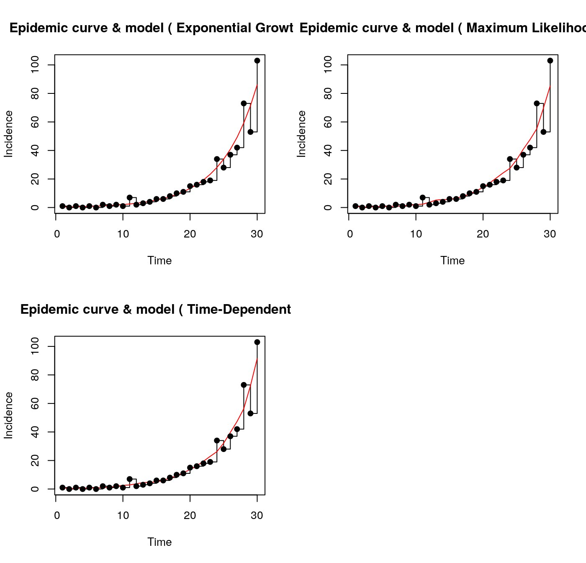

# sars2pack

The sars2pack R package includes data resources, workflows, and data
science tools to understand and interpret the COVID-19
pandemic. Access to data resources is "real-time" to get the most
up-to-date information. Use cases and introductory material are
available in vignettes and in documentation.

Contributions are welcome. Have an interesting analysis that you'd
like to share, write up an R markdown document and contribute it as a
vignette. If you are not used to working collaboratively in github,
just post a [new
issue](https://github.com/seandavi/sars2pack/issues/new) to ask for
help.

Thanks to the armies of people providing data for the rest of the
world, often on a volunteer basis. Without their tireless work, we
would not have these rapidly-developing resources.

# Install

```
BioManager::install('seandavi/sars2pack')
# OR
devtools::install_github('seandavi/sars2pack')
```

# Features

## Data resources available

- Johns Hopkins global pandemic time series
- USAFacts county-level US epidemic data
- NYTimes state and county-level US epidemic data
- COVIDTracker.com US state- and county-level epidemic data that includes detailed positive, negative, and pending test data
- US Healthcare Capacity dataset, including details on US hospital capacity and capabilities.
- US County-level metadata, including geospatial data

## Capabilities

- [X] Access data from multiple sources: jhu_data(), usa_facts_data(), nytimes_county_data(), nytimes_state_data(), covidtracker_data(), etc.
- [X] Estimate R0 for localities or countries.
- [X] Visualize time series pandemic case growth
- [X] Perform data mashups between COVID-19 pandemic data and
      additional geographic, financial, and demographic datasets
- [ ] Create static and interactive maps of COVID-19 data for states,
      countries, or even counties.

## Visualization






# Workflow status

Automated workflows and current status.

| Workflow Status | Description |
| --- | --- |
|  | Produces regularly updated data resources and products |
|  | Prepare and publish [pkgdown documentation](https://seandavi.github.io/sars2pack/) |


# Contribute

To contribute to this package please make a fork and then issue pull requests.

# Resources

## Similar work

- https://github.com/emanuele-guidotti/COVID19
- [Top 25 R resources on Novel COVID-19 Coronavirus](https://towardsdatascience.com/top-5-r-resources-on-covid-19-coronavirus-1d4c8df6d85f)
- [COVID-19 epidemiology with R](https://rviews.rstudio.com/2020/03/05/covid-19-epidemiology-with-r/)
- https://github.com/RamiKrispin/coronavirus
- [Youtube: Using R to analyze COVID-19](https://www.youtube.com/watch?v=D_CNmYkGRUc)
- [DataCamp: Visualize the rise of COVID-19 cases globally with ggplot2](https://www.datacamp.com/projects/870)


